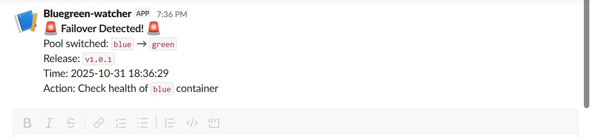
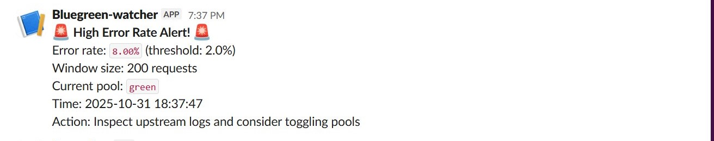

# Blue-Green Deployment with Nginx

This is a simple **Blue-Green Deployment** setup using Docker Compose and Nginx.  
It runs two application containers (**Blue** and **Green**) behind an Nginx reverse proxy that routes traffic to the active version.

---

## How to Run

### Step 1: Clone the project
```
git clone <your-repo-url>
cd <your-repo-folder>
```

### Step 2: Create your .env file
- A sample environment file is provided as .env.example.
- Copy it and modify it with preferred images
```
cp .env.example .env
```
### Step 3: Start the containers
- docker compose up -d

### Step 4: Verify it’s running
- Open your browser and go to:
```
http://<your-vm-ip>
```
### Step 5: Switching Between Blue and Green
#### To switch traffic to the other version:
1. Edit your .env file:
```
ACTIVE_POOL=green
INACTIVE_POOL=blue
```
2. Reload Nginx:
```
docker compose up -d 
```

## Chaos Testing & Failover Verification
### Step 1: Induce Failure
```
curl -X POST http://localhost:8081/chaos/start?mode=error
```
### Step 2: Observe Failover
```
for i in {1..20}; do curl -s http://localhost:8080/version; sleep 0.5; done
```
### Step 3: View Logs
```
docker exec nginx tail -5 /var/log/nginx/access.log
```
### Step 4: Verify Slack Alerts
#### Check your Slack channel for:
- Failover Detected!
- High Error Rate!

## Stop and Clean Up
```
docker compose down -v
```


